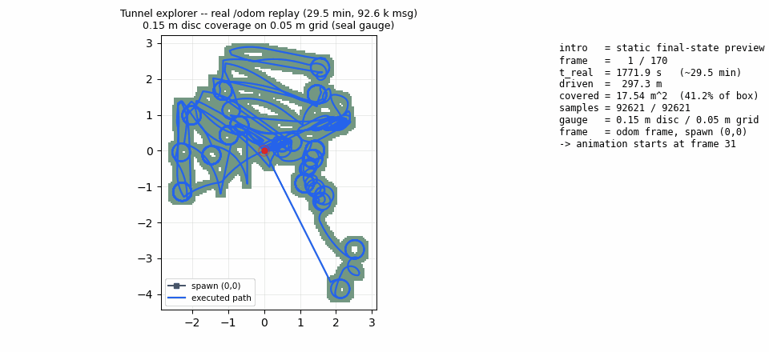
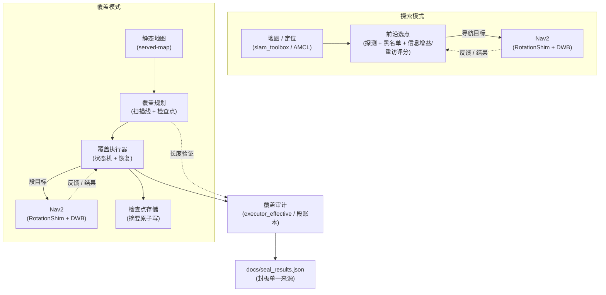

# ros2_tunnel_explorer


面向隧道式环境的 ROS 2 自主探索与覆盖任务原型，基于 Nav2 实现前沿选择、访问历史约束、覆盖执行与检查点恢复。当前运行证据来自 Gazebo 仿真，覆盖执行采用 **RotationShim + DWB**；独立开发的 MPC 控制器尚未接入该正式覆盖链（见 [已知限制](#已知限制)）。

仓库负责 *上层规划与覆盖*：探索模式（前沿选点 → Nav2）与覆盖模式（扫描线规划 → Nav2 → 状态记录 / 覆盖审计）。覆盖链结果来自封板 `docs/seal_results.json`；探索结果来自对应阶段档案（[关键结果](#关键结果)）。

---

## 演示

下方动图为一次 Gazebo 仿真回放（首帧为静态终态预览，无需等待动画即可理解场景）：



> 记录的 `/odom` 轨迹回放。绿色区域为假定工具半径（0.15 m 盘片）下的扫掠示意；显示比例以轨迹包围矩形为分母，**不是**正式任务覆盖率。

```bash
# 复现动图（render 子命令不依赖 ROS 2，只需 numpy + matplotlib + pillow）：
python scripts/make_explore_demo.py render \
    --in  results/demo_20260909/track.npz \
    --gif results/demo_20260909/explore_replay.gif

# 重新抽取 /odom（需要 ROS 2 Jazzy 与原始 bag）：
source /opt/ros/jazzy/setup.bash
python scripts/make_explore_demo.py extract \
    --bag /home/zhouyi/b6_chain/explore_map_bag \
    --out  results/demo_20260909/track.npz
```

---

## 三个核心贡献

- **分析与缓解重复访问、入口振荡**：5 跑阶段对照显示，仅引入信息增益 + 重访惩罚就把探索完成时间中位数从 281.5 s 压到 156.0 s（−44.6%），并在入口环场景把平均重访率从 49.3% 降到 34.6%（见 [关键结果](#关键结果)）。
- **实现覆盖任务执行与恢复**：检查点按摘要原子拒绝不完整写入；覆盖执行器把"是否完成"与"实际扫到多少"两件事分开审计，并按残差预算决策是否追加恢复路径。
- **区分任务完成与实际面积覆盖**：覆盖链结果来自封板 JSON（`docs/seal_results.json`），分母为受服务地图可执行掩码（含 36–37/37 段覆盖率）；探索结果来自对应阶段档案（[关键结果](#关键结果)）。口径不与轨迹包围矩形等视觉估算混淆。

---

## 架构

探索与覆盖是两个闭环，不是一条直线：



- **探索路径**：地图/定位 → 前沿选点 → Nav2。实线为发送导航目标（命令方向），虚线为 Nav2 的执行反馈与结果（闭环）。
- **覆盖路径**：静态地图 → 覆盖规划/执行器 → Nav2，实线为发送段目标；执行器旁路写到检查点存储与覆盖审计，审计结果落到封板 JSON。
- **Nav2 插件集成**（独立小图，不属于上述任一路径）：

  ```mermaid
  flowchart LR
    MPC["linear_mpc_controller<br/>(sister repo)"] -. Nav2 plugin .-> NAV2["Nav2"]
    style MPC stroke-dasharray: 4 3
  ```
  该连接未完成端到端验证（见 [已知限制](#已知限制)）。

---

## 关键结果

### 封板覆盖链 — 4 次正式运行
*条件：`cleaning_room_rect` 静态地图、AMCL + Nav2 + 覆盖执行器；odom 原点 = spawn (0,0)；分母 = 受服务地图可执行掩码 + 段账本。*

| 指标 | min | mean | max |
|---|---|---|---|
| `executor_effective`（段账本，每跑 36–37/37 覆盖段） | 0.8858 | 0.8976 | 0.9125 |
| `grid_in_mask_frac`（odom 样本落在可执行掩码内的比例） | 0.6365 | 0.7600 | 0.9429 |
| 行驶距离 / m | 117.3 | — | 172.7 |
| 执行重复比 `executor_repeat_ratio` | 0.62 | — | 0.72 |
| Python 规划长度 / m（`plan_from_map`） | — | 60.75 | — |

来源：`docs/seal_results.json` → `coverage_chain`，封板于 `v1.0.0-sealed` @ `b162fc1`。

### 探索阶段进度 — 5 跑 / 阶段
*条件：同一地图、0.4 m 前沿阈值；一栏一个统计量。*

| 阶段 | 引入的改动 | 完成度 | 重访中位 | 重访最大 | TTC 中位 |
|---|---|---|---|---|---|
| 2A | 最近前沿基线 | 80 %（4/5） | 20 % | 60 % | 281.5 s |
| 2B | 信息增益 + 重访惩罚 v1 | 100 %（5/5） | 0 % | 65 % | 156.0 s |
| 2C | 重访半径 0.75 m（阶段 2 终态） | 100 %（5/5） | — | 9 % | 200 s |
| 3C | 拓扑泛化（formal） | 40 %（2/5） | 57.1 % | — | — |
| 3D | 入口环恢复 | 100 %（5/5） | 37.5 % | — | — |

- 2A/2B：源自 `docs/stage2b_information_gain_revisit_results.md`；2B TTC 中位 **156.0 s / 5 跑**（旧 4 跑样本剔除 `run_debug` 后为 174 s）。
- 2C：重访半径 0.75 m 作为阶段 2 终态；详见 `docs/stage2c_revisit_radius_075_plan.md`。
- 3C/3D：源自 `docs/stage3d_entrance_loop_recovery_results.md`。3C 故意记为 FAIL——它正是触发 3D 恢复阶段的审计输入。

其余数字（残差覆盖恢复预算、缺分类）在 [技术文档索引](#技术文档索引) 中按需查阅。

---

## 快速复现

```bash
# 1) 规划 + 覆盖审计工具链（不需要实时仿真）
python scripts/regen_plan_from_masks.py \
    --masks b6_chain/plan/audit_masks.npz \
    --out   chain_day68_evidence/plan.json
python /path/to/linear_mpc_controller/benchmark_tools/scripts/audit_b6_coverage.py \
    --run_dir <run_dir> --masks b6_chain/plan/audit_masks.npz

# 2) 演示动图（无需 ROS 2；上方有完整命令）
python scripts/make_explore_demo.py render --in track.npz --gif explore.gif

# 3) WSL2 / Gazebo 全链路（约 18 分钟/跑 × 4 跑 ≈ 1.5 小时；CI 不跑）
bash scripts/run_chain_audit.sh <run_dir>
```

---

## 已知限制

- **CI 不跑覆盖链冒烟测试**——4 次正式跑约 1.5 小时，由维护者在本机执行；CI 仅做编译、lint、单元测试。徽章反映 CI 状态，非覆盖跑。
- **原始 `/odom` 包未入库**——仓库里 `track.npz` 是同场景 29.5 min 真实采样的下采样回放；要换场景需要重跑 `run_chain_audit.sh`。
- **覆盖率口径不能互换**——`r015`（0.15 m 足迹）是头版数字（`coverage_task.mean ≈ 0.628`），`r010`（0.10 m）给出保守区间（约 −20%）。两个数一并展示。
- **数量校正直觉**：受服务地图掩码是覆盖规范；不要按 `b6_chain/map_saved.yaml`（SLAM 坐标系，原点 ≈ −2.95 / −3.67）做分母——历史数字已撤回。
- **MPC Nav2 插件未接入覆盖链**：正式链用 RotationShim + DWB；插件在 `linear_mpc_controller` 单独验证。
- **残差 RL（姐妹仓库）已冻结**，不属于本仓库公开声明。

---

## 技术文档索引

> 首屏只要求读完以上。下面是工程档案，按"先用结论、过程可查"原则归档到 `docs/`。

| 文件 | 内容 |
|---|---|
| `docs/seal_results.json` | 封板单一来源（覆盖链公开数字由此出） |
| `docs/coverage_recovery_status.md` | 残差覆盖恢复预算决策 |
| `docs/chain_semantics.md` | 覆盖口径定义、坐标系修正 |
| `docs/day68_chain_audit.md` | 覆盖链语义、post-seal2 处置 |
| `docs/engineering_checklist.md` | 六项能力验收矩阵 |
| `docs/stage2a_nearest_frontier_baseline_results.md` | 阶段 2A 结果 |
| `docs/stage2b_information_gain_revisit_results.md` | 阶段 2B 结果（贡献 1 的核心证据） |
| `docs/stage2c_revisit_radius_075_plan.md` | 阶段 2C 计划与记录 |
| `docs/stage3d_entrance_loop_recovery_results.md` | 阶段 3D 结果（贡献 1 的入口环部分） |
| `docs/stage3c_failure_analysis.md` | 阶段 3C 失败分析（3D 触发源） |
| `docs/coverage_audit_u7.md`, `docs/known_issues.md`, `docs/merge_tree_note.md` | pre-seal 审计与合并树备注 |
| `docs/jazzy_compatibility.md`, `docs/environment_feasibility.md` | ROS 2 Jazzy 插件命名 / 环境可行性 |
| `docs/b6_demo.md`, `docs/advanced_round_resume.md` | B6 端到端录像（仿真）/ 进阶轮 ①②③④ 溯源矩阵 |

封板与归档标签：`v1.0.0-sealed` @ `b162fc1`（权威）、`v1.0.1-recovery-status` @ `5f89915`（恢复指针）。

---

## 仓库结构

```
tunnel_explorer_bringup/   launch / params / worlds / maps for the simulator
tunnel_frontier_explorer/  C++ 前沿探测 + 黑名单 + 目标选择
tunnel_coverage_executor/  C++ 覆盖执行器（扫描线 + 检查点 + 恢复）
tunnel_coverage_planner/   C++ 覆盖规划器（段生成 / 掩码处理）
tunnel_map_core/           地图、掩码、坐标系工具
tunnel_worlds/             Gazebo 世界 + 地图资源
scripts/                   审计 + 规划 + 跑脚本 + 演示动图生成器
artifacts/                 单次实验产物（清洁、缺分类）
results/                   覆盖闭环 / 演示 20260909 / 阶段档案
chain_day68_evidence/      封板规划 + 审计 JSON（140 KB 入库证据集）
docs/                      封板 + 阶段记录 + 工程审计（见上）
```

---

## License

Apache-2.0