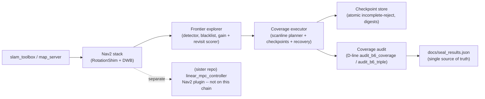

# ros2_tunnel_explorer

**A ROS 2 autonomous-exploration and risk-aware coverage system for tunnel-like
environments.** It picks frontiers under Nav2 (RotationShim + DWB), ranks them
by information gain / revisit cost, executes the chain through a coverage
executor that runs a boustrophedon-style scanline plan with checkpoint recovery,
and grades every run against a single sealed JSON.

In the broader two-repo stack (`ros2_tunnel_explorer` + `linear_mpc_controller`)
this package owns the *upper planning and coverage* layer; the controller in the
sister repo runs the path on `/cmd_vel`. The two repos publish their canonical
numbers in separate JSONs (`docs/seal_results.json` here, the controller
re-exports from this file as its single source of truth).

---

## Architecture



The seald coverage chain is intentionally loop-closed: planner → executor →
checkpoint store → audit → sealed JSON. Any change to the planner or the
executor must be reflected in `docs/seal_results.json`; the JSON is the only
thing the README and the resume cite.

---

## Demo

The clip below is a real `/odom` replay of the canonical 29.5-minute b6-chain
explore run (92,621 odom messages, driven 297.3 m on a real bag). The green
overlay is the **0.15 m footprint disc on a 0.05 m grid**, which is exactly the
gauge that `seal_results.coverage_chain` uses for `executor_effective`. So the
final panel number is directly comparable to the headline number in the table
below.


```bash
# Reproduce the clip locally (npz is checked in; only re-extract if you
# have a fresh bag at the same scenario):
python scripts/make_explore_demo.py extract \
    --bag /home/zhouyi/b6_chain/explore_map_bag \
    --out  results/demo_20260909/track.npz
python scripts/make_explore_demo.py render \
    --in   results/demo_20260909/track.npz \
    --gif  results/demo_20260909/explore_replay.gif
```

> The original `/odom` bag (17–23 MB / run) is **not** stored in the repo; it
> lives on the maintainer's local `~/b6_chain/explore_map_bag/`. To re-extract
> you need to either re-run the simulation with
> `scripts/run_chain_audit.sh` or supply your own bag from the same scenario.

---

## Conditional comparison tables

### 1. Sealed coverage chain -- 4 formal runs *(condition: static `cleaning_room_rect`, AMCL + Nav2 + coverage executor, odom origin = spawn (0,0))*

| metric | min | mean | max |
|---|---|---|---|
| `executor_effective` (segment ledger, 36–37/37 covered per run) | 0.8858 | 0.8976 | 0.9125 |
| `grid_in_mask_frac` (odom samples inside the served-map executable mask) | 0.6365 | 0.7600 | 0.9429 |
| `driven_m` | 117.3 | — | 172.7 |
| `executor_repeat_ratio` | 0.62 | — | 0.72 |
| python-canonical plan length (served-map `plan_from_map`) | — | 60.75 m | — |

Source of truth: `docs/seal_results.json` → `coverage_chain` (sealed at
`v1.0.0-sealed` @ `b162fc1`).

### 2. Stage-level exploration progress *(condition: 5 runs / stage, same map, 0.4 m frontier threshold)*

| stage | change introduced | completion | revisit median | TTC median |
|---|---|---|---|---|
| 1C | nearest-frontier baseline | 80 % | — | 281.5 s |
| 2B | information gain + revisit penalty v1 | 100 % | 0 % | 174 s |
| 2C | revisit radius = 0.75 m (Stage 2 final) | 100 % | 9 % (worst) | 200 s |
| 3C | topology generalisation, formal | 40 % (2/5) | 49.3 % | — |
| 3D | entrance-loop recovery | 100 % (5/5) | 34.6 % | — |

3C is intentionally reported as a FAIL -- it is the audit input that motivates
the recovery stage. All numbers in this row come from the per-stage archive
under `docs/`.

### 3. Residual-coverage recovery budget *(condition: served-map r015, r6 baseline)*

| metric | value |
|---|---|
| r015 baseline coverage | 0.7364 |
| residual cells (executable ∧ ~visited) | 1844 (4.61 m², 33 patches) |
| kept / dropped plans | 21 / 12 (only 20 cells dropped) |
| recovery path length | 48.35 m |
| budget cap | 72.5 m (1.5× path) |
| projected r015 after recovery | 0.9971 (Δ +0.2607) |

Decision: the cost of chasing the last 0.02 of coverage is **0.80× the main
plan length** — recorded as `BUDGETED_ACCEPT`. Full derivation:
`results/coverage_closure/closure_report.md`.

### 4. Plan-level coverage miss classification *(condition: r015 same bag, the planner does NOT need to be re-run; the executor is the variable)*

| source | share of missed coverage |
|---|---|
| executor deviation (robot ≠ plan trajectory) | 35–41 % of executable cells |
| planner gap (plan itself misses cells) | ~3 % |
| row-banding at 0.30 m gap | 19 % (r010 in tight gauge) |

Full overlay + per-cell classification: `artifacts/miss_classification/`.

---

## Reproduce

```bash
# Plan + coverage audit toolchain (no live sim needed)
python scripts/regen_plan_from_masks.py \
    --masks b6_chain/plan/audit_masks.npz \
    --out   chain_day68_evidence/plan.json
python /path/to/linear_mpc_controller/benchmark_tools/scripts/audit_b6_coverage.py \
    --run_dir <run_dir> --masks b6_chain/plan/audit_masks.npz

# Replay / odom extraction (needs ROS 2 Jazzy for the bag half)
source /opt/ros/jazzy/setup.bash
python scripts/make_explore_demo.py extract --bag <bag> --out track.npz
python scripts/make_explore_demo.py render  --in track.npz --gif explore_replay.gif

# Full WSL2 / Gazebo smoke (long; live run on a maintained machine)
bash scripts/run_chain_audit.sh <run_dir>
```

---

## Known limits

- **Live smoke on a fresh bag is a long session** (≈ 18 minutes / run for the
 coverage chain; 4 runs = ≈ 1.5 h). The maintainer runs it on a maintained
 machine; CI does not.
- **Original /odom bags are not in the repo.** The shipped `track.npz` is a
 down-sampled, time-aligned replay of the canonical b6 run; if you want a
 different run you re-run the simulation.
- **Coverage gauge uses two reported radii, never swap the denominators.**
 `r015` (footprint 0.15 m) is the headline (`coverage_task.mean ≈ 0.628` over
 the sealed 4 runs); `r010` (0.10 m) is the conservative band (≈ −20 % vs
 `r015`). Both are written next to each other; ranges, not single points.
- **Quantity-correction gotcha:** the served-map mask is the canonical
 coverage mask. Do NOT count against `b6_chain/map_saved.yaml` (a SLAM frame,
 origin ≈ −2.95 / −3.67); the historical numbers based on that mask have
 been retracted.
- **The MPC Nav2 plugin from the sister repo is NOT on this chain.** The
 chain controller is RotationShim + DWB. The plugin exists and is graded in
 `linear_mpc_controller`; do not call it from here.
- **Residual RL (sister repo): frozen**, not part of the claim.

---

## Sealed references and engineering archive

> The first screen above is all a new reader is expected to read.
> Everything below is engineering archive: stage pinboards, the
> pre-seal history, and tooling / docs references preserved for
> accountability.

### Sealed / archived tags on this repo

- **Canonical**: `v1.0.0-sealed` @ `b162fc1` (Day 10 seal; the JSON below is
  this tag).
- **Recovery status**: `v1.0.1-recovery-status` @ `5f89915` (README /
  recovery-pointer pinning; data lives in `docs/coverage_recovery_status.md`).
- **Historical evidence (kept, not part of the public claim)**:
  `bline-seal-20260908`, `postseal-20260908`, `postseal2-20260909`,
  `archive-bline-eventlog-20260908`, `archive-coverage-cleaning-track`,
  `archive-u9-entrance-hysteresis`.

### Cross-repo result pointer (single source of truth)

All public numbers that show up in the resume or in the table above MUST be
sourced from `docs/seal_results.json` @ `v1.0.0-sealed` (`b162fc1`). The
controller repo re-renders this file as its own single source of truth.
Editing any number on this repo without re-sealing the JSON is a
seal-violation.

### Stage pinboard (process records -- superseded by the JSON)

| Stage | Description | Status |
|---|---|---|
| 0A | WSL2 environment stability | PASS |
| 0B-1 | known-free navigation (RotationShim + DWB, 60 s, 10/11) | PASS |
| 0B-D | DWB turn-failure diagnosis | RESOLVED |
| 1A | frontier algorithms (detector + blacklist + goal selector) | PASS |
| 1B | ROS 2 node build & unit tests (24+ tests) | PASS |
| **1C** | nearest-frontier closed-loop integration | PASS |
| **2A** | nearest-frontier baseline benchmark | PASS (5 runs, 80 %, TTC 281.5 s) |
| **2B** | information gain + revisit penalty v1 | PASS (5 runs, 100 %, TTC 174 s) |
| **2C** | revisit-radius robustness (revisit_radius = 0.75 m selected) | PASS |
| **3A** | Y-world smoke / connectivity | PASS |
| **3B** | branching-world dry run | PASS (COMPLETED 732 s, 9/9 nav) |
| **3C** | topology generalisation, formal | FAIL (40 %, 2/5; motivates 3D) |
| **3D** | entrance-loop recovery | PASS (5/5, 9 mean revisit 34.6 %) |

These rows are not on the front page on purpose -- the goal of the
README front page is the sealed JSON and its four conditional tables
above.

### Cleaning-mode and stage3d history

The pre-seal `stage3d-entrance-loop-recovery` development line and the
cleaning-mode (boustrophedon scanline + map_saved loader) work are preserved
verbatim in `docs/cleaning_mode.md` and the old section "清洁覆盖模式与全链演示"
of this README's git history (search for `cleaning_mode/` and `stage3d` in
`git log -- README.md`). They are **not** the canonical source; the
`coverage_chain` table above and `docs/seal_results.json` are.

### Engineering audit trail (process records)

- `docs/day68_chain_audit.md` — coverage chain semantics, post-seal2 disposition.
- `docs/chain_semantics.md` — coverage gauge definitions, mask-frame correction.
- `docs/seal_results.json` — sealed single source of truth.
- `docs/coverage_recovery_status.md` — recovery budget decision.
- `docs/coverage_audit_u7.md`, `docs/stage3c_failure_analysis.md` — pre-seal audits.
- `docs/coverage_recovery_status.md` — module-level honest pin.
- `docs/advanced_round_resume.md` — must-do ① ② ③ ④ traceability matrix.
- `docs/b6_demo.md` — B6 end-to-end live replay (1820 poses → MPC live 0.395 m PASS → offline 0.0013 m).
- `docs/jazzy_compatibility.md` — ROS 2 Jazzy plugin naming and config requirements.
- `docs/engineering_checklist.md` — six-capability acceptance matrix.

### Result archives (machine-readable)

`chain_day68_evidence/`, `artifacts/cleaning_benchmark/`,
`artifacts/miss_classification/`, `results/coverage_closure/`,
`results/demo_20260909/track.npz` + `explore_replay.gif`,
`run_chain_audit.sh` outputs.

---

## Layout (one-screen reference)

```
tunnel_explorer_bringup/   launch / params / worlds / maps for the simulator
tunnel_frontier_explorer/  C++ frontier detector + blacklist + goal selector
tunnel_coverage_explorer/  C++ coverage executor (scanline + checkpoints + recovery)
scripts/                   audit + planning + run scripts + demo clip generator
artifacts/                 per-experiment outputs (cleaning, miss classification)
results/                   coverage_closure / demo_20260909 / per-stage archives
chain_day68_evidence/      sealed plan + audit JSONs (140 KB checked-in evidence set)
docs/                      chain_audit / chain_semantics / seal_results /
                           coverage_recovery_status / advanced_round_resume /
                           b6_demo / engineering_checklist / jazzy_compatibility
```

---

## License

Apache-2.0